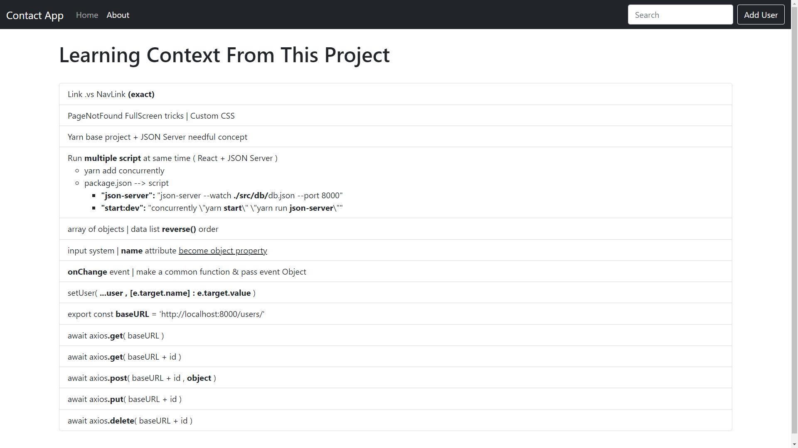

21-Jun-2021

# React | User CRUD App 
<!-- <|> [`Live Link`](www)  -->

## Topic of Focus:
* React Routing + 404 page
* Link vs. NavLink (exact)
* Context API for data sharing among all components

## Technologies | Project is created with: 
* HTML 
* CSS 
    - Bootstrap 5 

* React `Yarn Base Project`
    - `yarn add react-router-dom`
    - `yarn add json-server`
    - `yarn add concurrently` (add its script into package.json file)
        - `"json-server" : "json-server --watch ./src/db/db.json --port 8000",`
        - `"start:dev": "concurrently \"yarn start\" \"yarn run json-server\"",`
        - `yarn run start:dev`
 
    - `yarn add axios`

* GitHub
* API use from [JSON Place Holder](https://jsonplaceholder.typicode.com/users)

## Sample Image:

